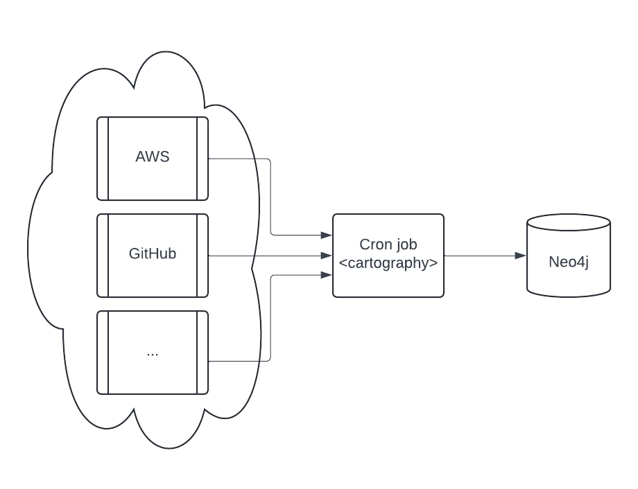
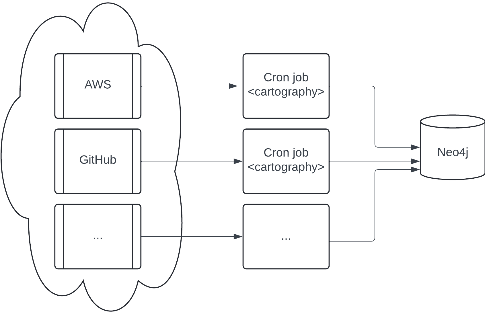

# Cartography Production Operations

This document contains tips for running Cartography in production.

## Deployments

### Simple

The simplest production deployment involving Cartography looks something like this:



- Configure a Neo4j database. Specifics on this are out of scope of this document; refer to Neo4j's resources on how to
  do this.
- Configure a scheduled task (e.g. a cron job) to be able to access one or more data providers. See the
  [modules](../root/modules) section for specifics on each. We recommend that you run the cron job on a separate machine
  from the Neo4j database.

### Parallel jobs
If a single cartography job takes longer than you would like, you can configure jobs to run in parallel where each job syncs different resources.



Making sure that 2 resources of the same type never run at the same time is critical: you will encounter race conditions where one job may delete the resources synced by the other.

The above diagram shows AWS and GitHub running on different jobs, but you can get more granular than that: as an example, you can have job 1 run AWS S3 and job 2 run AWS RDS in parallel with no negative effects.


## Maintaining a up-to-date picture of your infrastructure

Running `cartography` ensures that your Neo4j instance contains the most recent snapshot of your infrastructure. Here's
how that process works.

### Update tags

Each sync run has an `update_tag` associated with it,
which is the [Unix timestamp of when the sync started](https://github.com/lyft/cartography/blob/8d60311a10156cd8aa16de7e1fe3e109cc3eca0f/cartography/sync.py#L131-L134).
See our [docs for more details](https://cartography-cncf.github.io/cartography/dev/writing-intel-modules.html#handling-cartographys-update_tag).

### Cleanup jobs

Each node and relationship created or updated during the sync will have their `lastupdated` field set to the
`update_tag`. At the end of a sync run, nodes and relationships with out-of-date `lastupdated` fields are considered
stale and will be deleted via a [cleanup job](https://cartography-cncf.github.io/cartography/dev/writing-intel-modules.html#cleanup).

### Sync frequency

To keep data updated, you can run `cartography` as part of a periodic script (cronjobs in Linux, scheduled tasks in
Windows). Determine your needs for data freshness and adjust accordingly.

## Observability

### statsd

Cartography can be configured to send metrics to a [statsd](https://github.com/statsd/statsd) server. Set the
`CARTOGRAPHY_STATSD__ENABLED=True` flag when running `cartography` for sync execution times to be recorded and sent to
`127.0.0.1:8125` by default (these options are also configurable with the `CARTOGRAPHY_STATSD__HOST` and `CARTOGRAPHY_STATSD__PORT` options).
You can also provide your own `CARTOGRAPHY_STATSD__PREFIX` to make these metrics easier to find in your own environment.

## Docker image

A production-ready docker image is available in [GitHub Container Registry](https://github.com/lyft/cartography/pkgs/container/cartography). We recommend that you avoid using the `:latest` tag and instead
use the tag or digest associated with your desired release version, e.g.

```bash
docker pull ghcr.io/cartography-cncf/cartography:0.96.1
```

This image can then be run with any of your desired command line flags:

```bash
docker run --rm ghcr.io/cartography-cncf/cartography:0.96.1 --help
```
